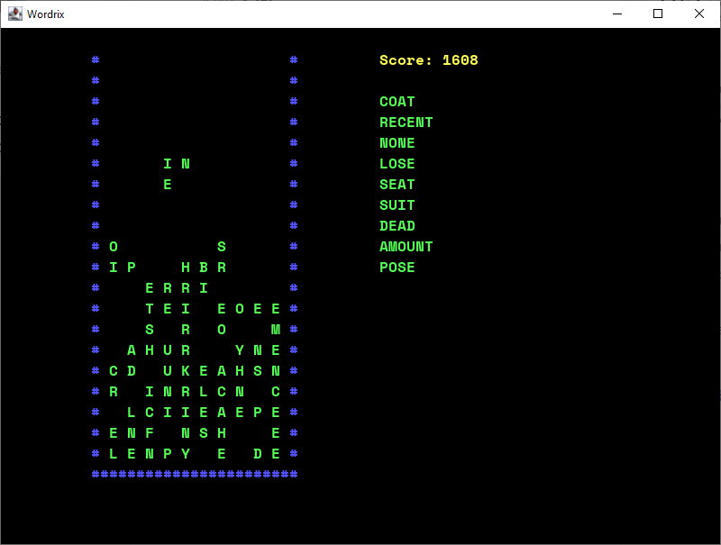

# Wordris

## Description

Wordris is a word game that combines elements of Tetris and Scrabble. 
The game is played on a 10x20 grid, where the player must place falling letter blocks to 
form words. The goal is to clear as many rows as possible by forming words, 
similar to how you would clear rows in Tetris by forming lines.

## How to play

1. The game starts with a random letter block falling from the top of the grid.
2. Use the arrow keys to move the block left or right.
3. Press the space key to make the block fall faster.
4. Press the Up or Down arrow key to rotate the block.
5. When the block lands, the computer will check if the letters form a valid word.
6. If a valid word is formed, the letters of word will be cleared and the player will earn points.
7. The game ends when the grid is full and there are no more valid moves.

## Features

- Random letter blocks: Each block contains a random set of letters.
- Word validation: The computer checks if the letters form a valid word.
- Scoring system: Players earn points for each valid word formed.
- High score tracking: The game keeps track of the player's highest score.
- Difficulty levels: Players can choose between block set, minimum letters in the words, and languages.
- Global Leaderboard: Players can view the top scores of other world players.

## Getting started

### Fastest way to play

1. Install Java 8 or higher if you don't have it already from here: [Java JRE](https://www.java.com/en/download/)
2. Download package from [releases](https://github.com/vadcom/wordris/releases), unpack and run the **run.bat** file.

### Building from source

1. Clone the repository
2. Clone dependencies [dumb-menu](https://github.com/vadcom/dumb-menu) and [dream-score-client](https://github.com/vadcom/dream-score-client) and install them in your local maven repository.
2. Run `mvn clean package` to build the project
3. Run `javaw -jar target/wordris-1.0.0.jar` to start the game
4. Enjoy!

